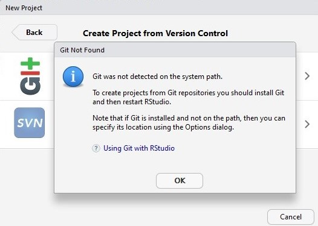

Version control with GitHub for Rstudio

### 1.0 Contents

- [1.1 Inspiration](https://github.com/jungxue/R-lyublyu-Git/blob/master/README.md#11-inspiration)
- [1.2 Basic setups](https://github.com/jungxue/R2Git/blob/master/README.md#12-basic-setups)
- [1.3 Github Basics](https://github.com/jungxue/R2Git/blob/master/README.md#13-github-basics)
- [1.4 Example 1: Setting up a bookdown Project for Study Notes](https://github.com/jungxue/R2Git/blob/master/README.md#14-example-1-setting-up-a-bookdown-project-for-study-notes)
- [1.5]()
- [Reference](https://github.com/jungxue/R2Git/blob/master/README.md#reference)

-------------------------------------------------------------------------------------------------------------------

### 1.1 Inspiration

I am at a stage of my study where needs for programming is becoming essential, and I start to come across this thing called Github. At first I thought it was like a forum or community where programmers hangout, and spin yarns, but one day I received an seminar notification email from Medhi about [Blakes's Github seminar](https://github.com/sccuoa/intro-to-git) and thought yeah I kept came across this github thing might as well see what is it about. And then I learnt about version control, I wish I knew about and start using github earlier.

What are benefits of incorporating Github with my R projects:

1. **Version Control**, keep track on your projects and makes it easier to collaborate. Obviously. 
2. Able to browse and download other peoples **shared codes**, this is what I do for fun now.
3. Create a **public profile** for myself, my github is the first thing that came up in google search if I search my name.
4. An alternative platform which I can **do blog/notes**, at Uni and at home. It is better than good old microsoft word. 
5. I can quickly **present my projects** or codes to other people by sending them a github repository link.
6. I Need to use github if I was to create my **personal website** using **R Blogdown**.

Some cons

1. I use github to procastinate, this wastes a lot of time
2. I started compare myself to other people on Github. And this usually end up in me realising how much I really suck at coding, losing self esteem and contemplating about my life. 
3. There are no spell checks, now people will see how bad my spelling really is. Maybe I need to do my markdown files on an editor rather than do it on github. 
4. I am still unfamilar with github and I do things ineffeciently, if you see me making like 100 commits in a day, that does not meant I did a lot of work on that day, it probably meant that I was confused as and had to keep doing commints to fix things up.  

-------------------------------------------------------------------------------------------------------------------

### 1.2 Basic setups

**Step 1** Download and install all required softwares

First, you need to have R (preferably also the latest version of R-Studio) and a Github account in order to start, and also Git bash for the commands. Here are links for you to start your download. 

- [**R**](https://cran.r-project.org/)
- [**R-Studio**](https://www.rstudio.com/products/rstudio/download/)
- [**Github**](https://github.com/)
- [**Gitbash**](https://gitforwindows.org/) [(automatic download)](https://git-scm.com/download/win)

**Step 2**  Check if you already have git installed In RStudio:

File → New Project → Version Control → Git

If you do not have git or was not setup properly, you will see this


Otherwise you will something like this. 


**Step 2** Introduce ourselves to git

You are an user so you need to identify yourself.

Open Git Bash or use the terminal tab of R studio, and use the following code to set up your name and email

```git
$git config --global user.name 'Your Name'
$git config --global user.email 'your@email.com'
$git config user.name
Your Name
$git config user.email
your@email.com
```
Note: If you get an error `More than one value for the key user.name`, that is due to your names overriding each other.
You can use `--get-all` and you will see multiple names. 
You can use `--replace-all` option to clear all the names and rename yourself. 

```git
$git config --get-all user.name
'Your
'your
$git config git config --get-all user.name 
$git config --global user.name 'Your Name'
$git config user.name
Your Name
```

**Step 3** Secure Shell (SSH) key (optional)

SSH allows you to connect and authenticate to remote servers.

Tools → Global options → Git/SVN → Create RSA Key → View Public Key

Copy your key and get on Github https://github.com/settings/ssh/new and associate the key with your account.

And check your connection on R terminal: 

```git
C:\Users\Tokor>ssh -T git@github.com
The authenticity of host 'github.com (192.30.255.113)' can't be established.
RSA key fingerprint is 16:27:ac:a5:76:25:2d:36:63:1b:46:4d:eb:df:a6:48.
Are you sure you want to continue connecting (yes/no)? Yes
Warning: Permanently added 'github.com,192.32.255.613' (RSA) to the list of known hosts.

Hi jungxue! You've successfully authenticated, but GitHub does not provide shell access.

```
After all these setups bro you are all good to go!

-------------------------------------------------------------------------------------------------------------------

### 1.3 Github Basics
Continue here


### 1.4 Example 1: Setting up a bookdown Project for Study Notes

### 1.5 Example 2: Version control for my thesis R codes

-------------------------------------------------------------------------------------------------------------------

### Reference

- **Ewen Harrison** R-blogger [RStudio and GitHub](https://www.r-bloggers.com/rstudio-and-github/)
- **Blake Seer** UoA SCC [intro to git (for R users)](https://github.com/sccuoa/intro-to-git)
- **Nathan Stephens** Rstudo support [Version Control with Git and SVN](https://support.rstudio.com/hc/en-us/articles/200532077-Version-Control-with-Git-and-SVN)
- **Hadley Wickham** [webinar](https://www.rstudio.com/resources/webinars/collaboration-and-time-travel-version-control-with-git-github-and-rstudio/)

